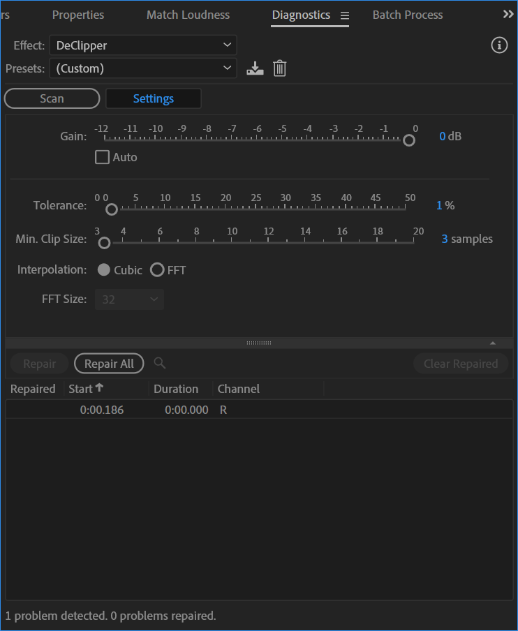
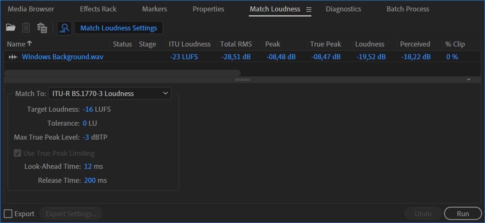
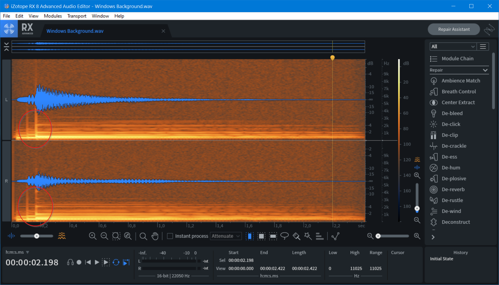
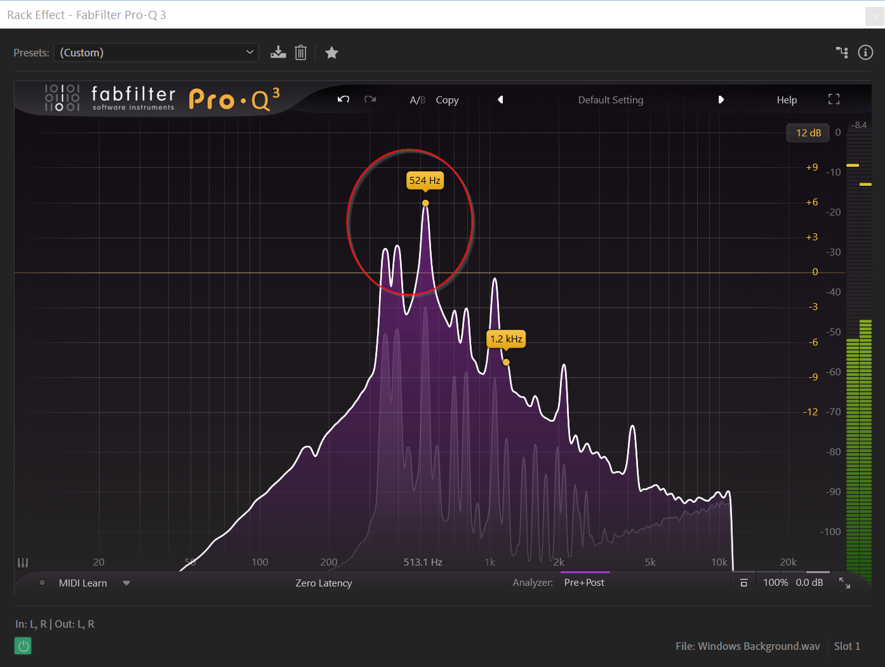
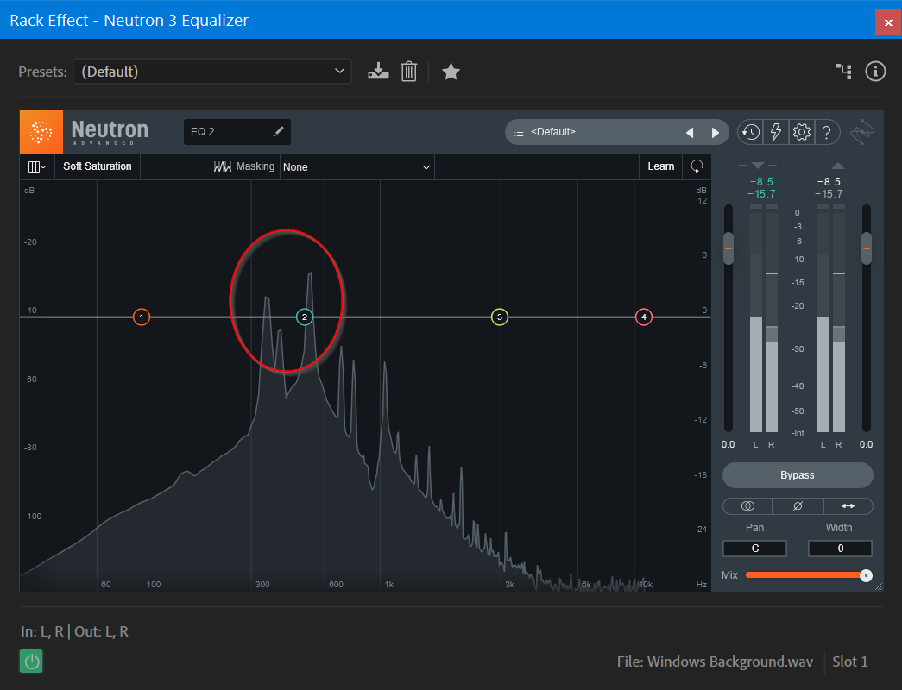
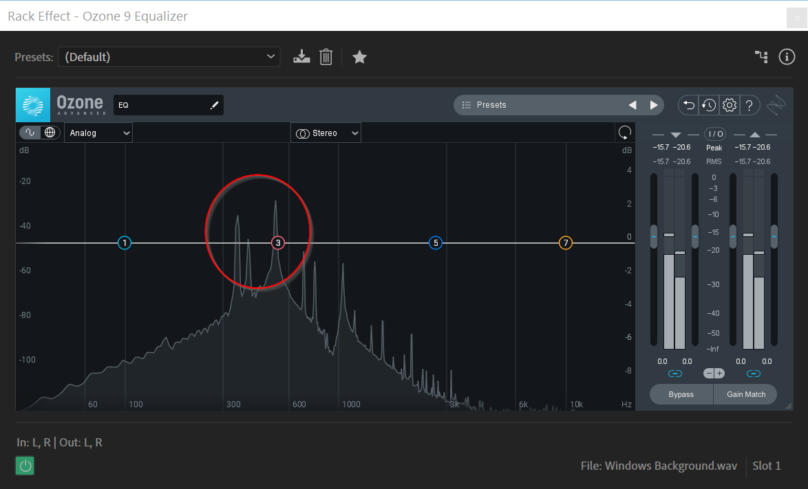
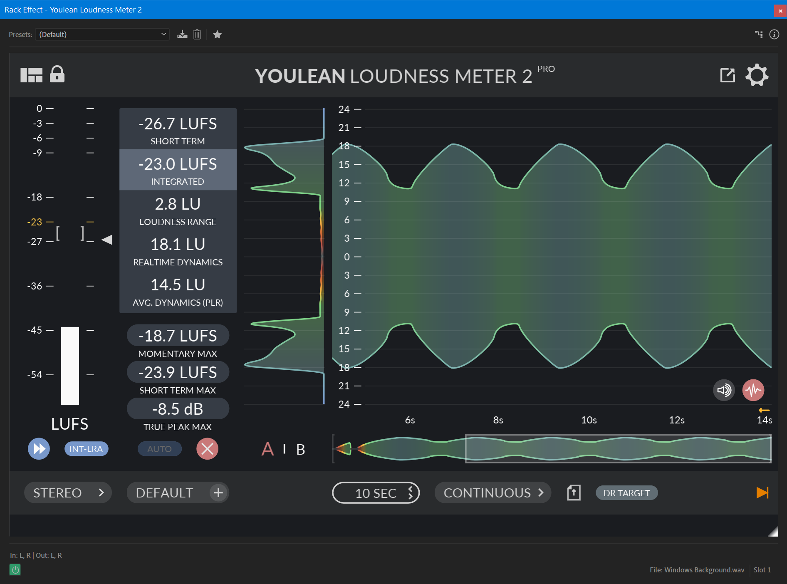
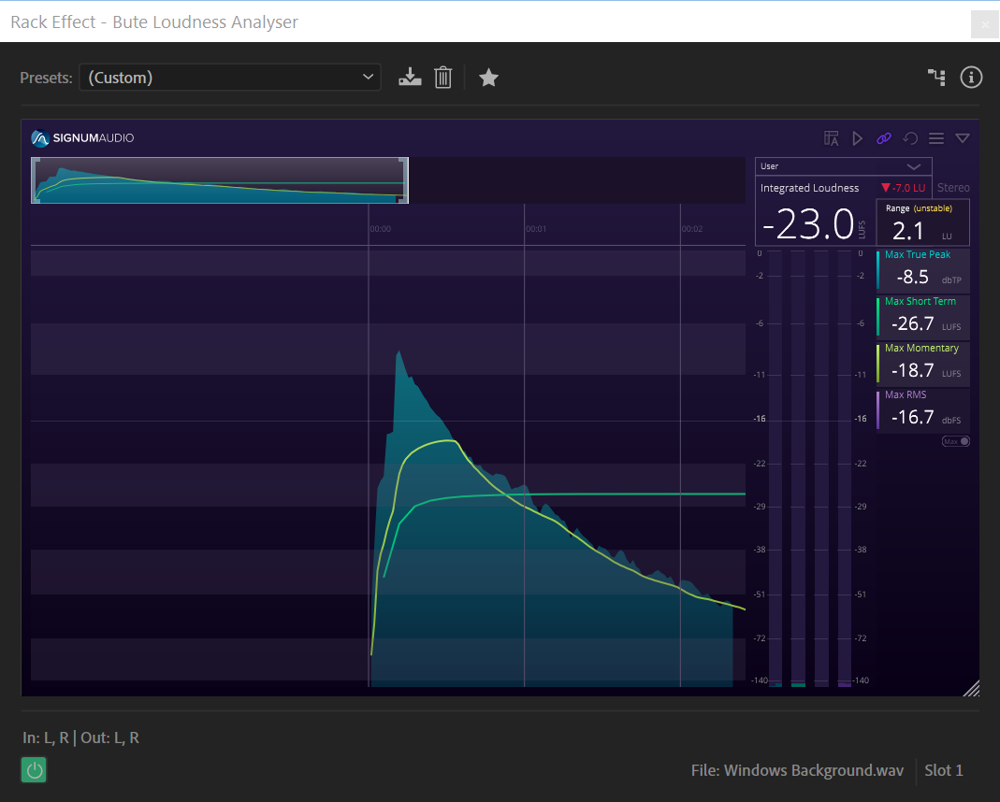
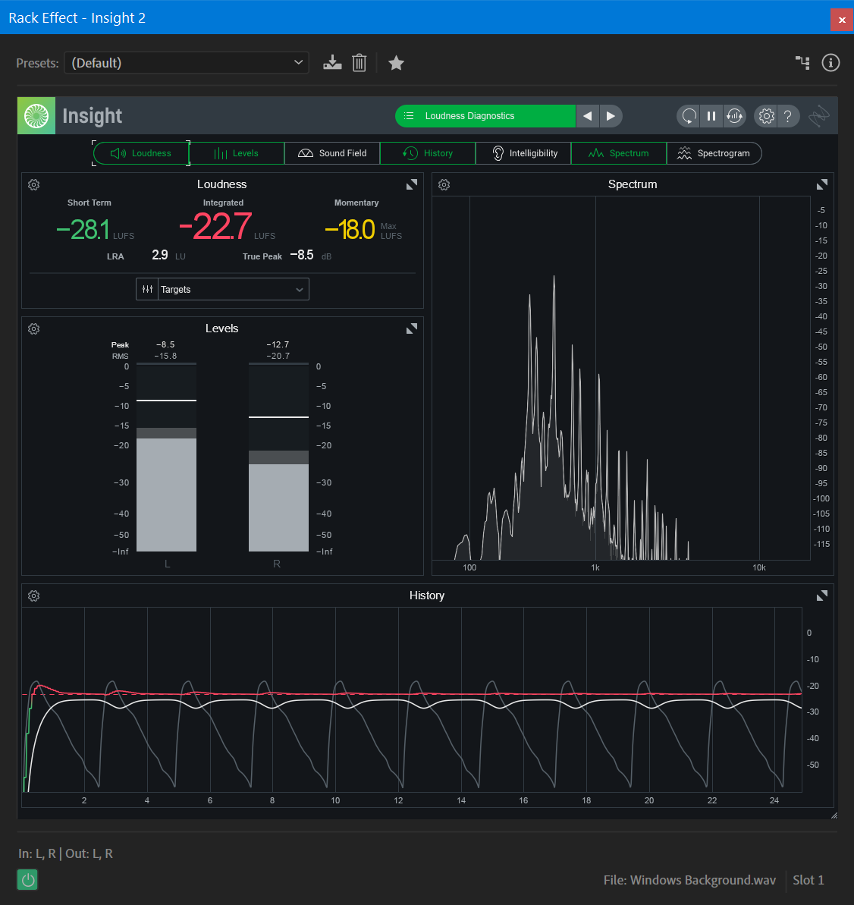

# Detecting and measuring the problem

I have fairly bad hearing, so I don't trust my ears for this kind of diagnostic purposes. How can we "prove" it happens?

## Software used in measuring

The following have been used in the attempt to detect and verify the problem.

- Adobe Audition: Digital Audio Workstation
- iZotope RX8 Advanced: Digital Audio Workstation specialized in fixing audio issues.
- FabFilter Pro-Q3: Equalizer VST plugin.
- iZotope Neutron 3 Equalizer: Equalizer VST plugin.
- iZotope Ozone 9 Equalizer: Equalizer VST plugin.
- FabFilter Pro-L2: True Peak limiter VST plugin.
- Youlean Loudness Meter 2: Loudness measurement VST plugin.
- Bute Loudness Analyzer
- iZotope Insight 2

## Adobe Audition

Adobe Audition (AA from now on) is my primary DAW in everyday life, and where I was working when the problem was first discovered (through use of the Pro-Q3 plugin, see dedicated section below).

AA is one of the few tools that can actually discover this problem, using the Diagnostics window.

Interestingly, it apparently only finds the issue in the right channel, while I am convinced it is slightly more of a problem in the left (why is discussed in other sections).

Asking AA to repair the problem through the diagnostics window does not remove it, though it might reduce it slightly - I don't know yet how to tell for sure.

The Frequency Analysis window in AA does not seem to notice the audio ever going above approximately -20dBFS in any frequency.

The Match Loudness feature is extremely useful in general, but it does not do much here except confirm the peak levels and that nothing considered clipping is going on in the file.

## iZotope RX8 Advanced

I use RX8 for audio repair, and it does an amazing job. However, I have not been able to detect the problem yet using the software. It has a de-clip module that works well on general clipping, but it does little to address the micro-distortion issue.

However, the audio file display does show the energy levels as long as you are not in waveform-only view.

## FabFilter Pro-Q3

This is the plugin I initially used to verify that there was actually something going on in the frequency spectrum. When you mouse over the display as audio plays, the peak values for each frequency is "sticking" so you can see this clearly.

The plugin has not been configured to change the audio at all, this is just analyzing the incoming waveform, and specifically the purple area shows the peak values after about 8-10 playthroughs.

There is little doubt that these frequencies cross the 0dBFS threshold, and in time they correspond exactly with the audible distortion that I hear. On the right side of the screenshot you can see that RMS level is calculated to be -8.4dBFS on the left channel, and slightly lower on the right.

## iZotope Neutron 3 Equalizer

I also own this plugin, so I consulted it for a "second opinion". I don't know that there is a feature to have it freeze the peak values, so my screenshot is just one taken as distortion occurs. 

Again, going above 0dBFS in the 300-600 range is pretty obvious visually.

## iZotope Ozone 9 Equalizer

Made by the same company as Neutron 3 above, I would not expect a huge difference in the results, and I was not really surprised.

There can be little doubt that these three equalizers confirm that the sound levels (SPL?) in certain frequencies go above the 0dBFS threshold.

## FabFilter Pro-L2

Now we're getting to interesting territory. A limiter is supposed to help make sure the audio signal doesn't go above a certain level, right? However, my [theory](theory.md) is that this only applies to the RMS level, calculated as the mean level for the whole frequency spectrum. How to figure this out? I try to configure Pro-L2 to not allow anything past -3dBFS out. But as it operates on RMS levels, the audio file does not cross the threshold, and the limiter never does anything - confirmed by using the same instance/configuration of Pro-Q3 after it in the effects chain.

## Youlean Loudness Meter 2

This is not what this meter is used to measure - it is used to measure loudness in LUFS to help ensure that your audio file meets required standards. I am including it here for completeness (using everything I have to test for this issue).

There is no identification that I can find that the audio file being played is crossing the 0dBFS threshold in the 200-600Hz region.

## Bute Loudness Analyzer

Like above, this is for making sure you meet standard requirements. This is not a frequency diagnostics tool. But it got to play along anyway.

Here it is set to show the "max mode", as opposed to live frequency view. -8.5dBFS seems to be the common idea of the maximum level of this audio file.

## iZotope Insight 2

I am a little surprised at Insight 2 - I thought it would be able to show me the problem as clearly as the equalizers above, but this screenshot does not give any indication that there might be an issue.

Even if it is also focused on LUFS, it shows true peak of the audio file as -8.5dBFS.

## Suggestions for other tools

If you know of tools that might help with this issue, please let me know. I don't have an endless budget for audio gear/software but I will consider suggestions.
